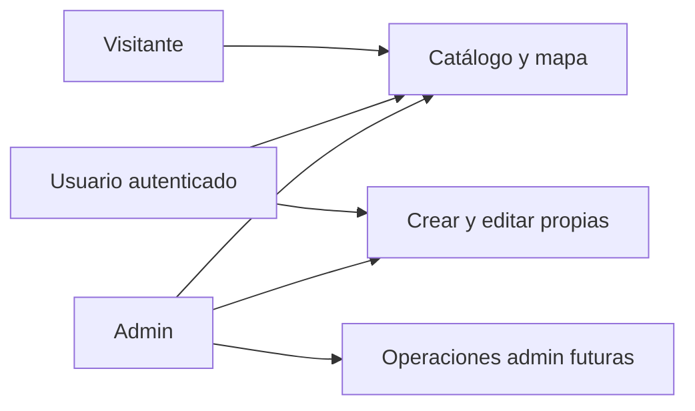
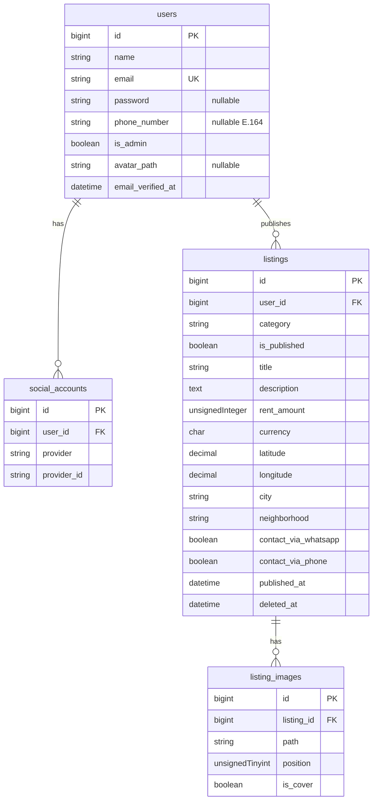

# Requerimientos MVP y diseño de datos — Radica

Este es el documento canónico del MVP. Lo vamos a construir **por rebanadas**, no de un solo golpe: cada paso deja algo usable y se explica antes de pasar al siguiente.

Radica es hoy el Laravel React starter kit: Laravel 13, Inertia + React, Fortify (email/contraseña, registro, reset y verificación de email). No hay dominio de viviendas todavía. El esquema actual es el de Fortify/sesión (`users`, `sessions`, `password_reset_tokens`, `passkeys`).

## Cómo vamos a construir (aprendizaje)

No implementamos Socialite + mapa + CRUD + catálogo en un solo PR. El orden de las rebanadas está pensado para que el dominio (viviendas) exista *antes* que las integraciones externas (OAuth, Mapbox).

| Rebanada | Qué queda funcionando | Qué se aprende |
| --- | --- | --- |
| 0. Fundamento de datos | Enums, migraciones, `users.phone_number`, modelo `Listing`, factory, tests de visibilidad | Migraciones, Eloquent, scopes, enums PHP, por qué el esquema va primero |
| 1. Catálogo público | Listado + ficha sin mapa | Rutas, controladores, Inertia, policies, queries |
| 2. Publicar / editar / despublicar | Un usuario logueado crea, edita y publica/despublica | Form requests, autorización, `is_published`, teléfono del dueño + canales |
| 3. Fotos | Galería 1–10, obligatoria al publicar | Uploads, disco `public`, relaciones hasMany, validación min/max |
| 4. Filtros “en vivo” | Buscador ciudad/colonia actualiza el listado | Debounce, Inertia partial reloads / `useHttp` |
| 5. Mapa | Pines que siguen el filtro, un solo map load | Mapbox, GeoJSON, no remount |
| 6. Google + Facebook | Tres formas de entrar | OAuth, Socialite, password nullable, vincular cuentas |
| 7. Admin mínimo | `is_admin` + Gate; tu usuario vía `ADMIN_EMAIL` | Gates vs policies vs roles |

Cada rebanada incluye tests Pest de lo que acaba de nacer, no de todo el producto.

---

## 1. Qué es el MVP (y qué no)

**Producto:** un tablero donde cualquiera ve publicaciones y, si inicia sesión, puede publicar una vivienda que quiere rentar. No hay marketplace de pagos ni roles de “arrendador” vs “inquilino”.

**Contacto (decidido):** el número vive en el **usuario** (`users.phone_number`). Cada publicación elige *cómo* se puede usar ese número: WhatsApp y/o llamada. Por defecto las dos; al menos una. El interesado contacta al dueño (`wa.me` y/o `tel:`). No hay chat interno. El teléfono no es obligatorio al registrarse (sobre todo con Google/Facebook); sí lo es para **publicar**.

**Geografía (decidido):** el esquema es para México (`country = MX`) y se puede acotar después por estado/ciudad (config o query). No hay catálogo nacional de colonias en el MVP: ciudad y colonia se guardan como texto + coordenadas.

**Ubicación permanece en `listings` (decidido):** no hay modelo/tabla `Location`. Es un *valor* del anuncio (texto + pin), no una entidad con vida propia. Extraer 1:1 duplicaría filas y obligaría JOIN/`with('location')` en el catálogo, que es la query más caliente. Extraer de verdad (catálogo de colonias, varios anuncios por edificio) sería aditivo: `places` + `listings.place_id`. En la rebanada 1 se puede agrupar al serializar a Inertia (`location: { city, neighborhood, lat, lng }`) sin cambiar el esquema.

### En alcance

- Catálogo público (sin login) de viviendas **visibles**
- Filtros de ubicación (texto: ciudad, colonia, etc.) que refrescan listado **y** pines del mapa sin recargar la página
- Mapa con un pin por vivienda visible
- Publicar / editar / despublicar / eliminar **las propias** publicaciones (requiere login)
- `is_published`: al crear está publicado; el dueño despublica a mano (p.ej. cuando se renta). No hay estado disponible/rentado ni ocultado a 7 días
- Auth: email+contraseña (Fortify) + Google + Facebook
- Rol `admin` solo para tu usuario, sin panel de administración todavía (solo el flag y un Gate para el futuro)

### Fuera del MVP (explícito)

- Chat, favoritos, reseñas, pagos, contratos, calendario, destacados de pago
- Roles arrendador/inquilino, verificación de identidad, reportes de anuncios
- Actualización “en vivo” cuando *otro* usuario publica (eso sería WebSockets / Reverb)
- Panel admin (moderar, borrar ajenos)

---

## 2. Modelo de acceso

- Visitante: ver catálogo, ficha, mapa, filtros.
- Usuario: lo mismo + CRUD de **sus** listings + publicar/despublicar.
- Admin: `users.is_admin = true`. En el MVP no hay pantallas extra; el Gate `admin` queda listo. Un seeder/`ADMIN_EMAIL` en `.env` marca tu cuenta.

Cualquier usuario autenticado puede publicar. No hay tabla `roles` ni Spatie Permission: un boolean basta para “solo yo”.

---

## 3. Publicaciones

**Categorías** (PHP enum, no tabla): `room`, `apartment`, `house`. Pocas diferencias → **una sola tabla** con columnas nullable por categoría. La validación (Form Request) exige el subconjunto que toca; las columnas de la otra categoría quedan `null`.

| Compartido | Cuarto | Departamento y casa |
| --- | --- | --- |
| título, descripción, renta mensual MXN, fotos (1–10), canales de contacto, ubicación, amueblado, mascotas | `bathroom_type`: `own` \| `shared` (baño propio o compartido) | `bedrooms` (int), `bathrooms` (int), `area_m2` (int, opcional), `has_parking` (bool) |

No hay depósito, ni piso, ni jardín. El cuarto no usa recámaras/baños-cantidad/m²/estacionamiento: esa pregunta no aplica (el baño es propio o compartido, no un conteo).

**Contacto — número vs canal:**

- El número es identidad del dueño → `users.phone_number` (un solo móvil; en México llamada y WhatsApp casi siempre son el mismo).
- El canal es preferencia del anuncio → `contact_via_whatsapp` y `contact_via_phone` (ambos `true` por defecto; check: al menos uno).
- La ficha lee el teléfono **actual** del dueño (si lo cambia en perfil, todos sus anuncios usan el nuevo). No hay override por listing en el MVP.
- Publicar exige teléfono en el perfil. Registro/OAuth no: Google y Facebook no entregan un móvil usable. Si al publicar no hay número, el formulario lo pide y lo guarda en el usuario.
- Formato: E.164 (`521…` para MX) para que `wa.me/{n}` y `tel:+{n}` funcionen.

**Fotos:** obligatorias, mínimo 1 y máximo 10; `is_cover` (o la de `position` más baja) es portada. Disco `public` de Laravel (sin Spatie Media). No se puede publicar sin al menos una imagen (la regla de producto se cierra en la rebanada 3; las 0–2 pueden usar factories sin fotos).

**Visibilidad pública:**

- `is_published = true` → catálogo (y mapa). Al crear, default `true`.
- `is_published = false` → el dueño lo sigue viendo en “Mis publicaciones”; el catálogo no. UI: **Publicar / Despublicar** (verbos). No se llama “visible”: eso lo calcula el query.
- `published_at` ordena el catálogo (cuándo salió). Despublicar no la borra.
- soft delete (`deleted_at`) = el dueño **eliminó** el anuncio (papelera), no es lo mismo que despublicar.

`visibleInCatalog()`: `where('is_published', true)` AND not trashed.

**“Tiempo real” de filtros:** debounce (~300 ms) + petición Inertia/`useHttp` que devuelve listado + GeoJSON. El mapa **no se destruye**: solo se actualiza la source de pines. Eso es lo que el usuario percibe como tiempo real y, además, no consume map loads extra.

---

## 4. Mapas: Mapbox sí, con plan B

**Recomendación: Mapbox GL JS en el MVP.**

Comparación relevante para un arranque sin cobro:

- **Mapbox GL JS:** 50 000 *map loads* web/mes gratis; luego ~$5 / 1 000. Un map load = cada vez que se hace `new mapboxgl.Map(...)`. Geocoding/Search es **otro** cupo (~100 000 temporales/mes). Mejor calidad de mapa y de búsqueda de colonia/ciudad en México que Nominatim.
- **Google Maps:** más caro; no encaja con “no gastar al principio”.
- **Leaflet + teselas OSM públicas:** la librería es gratis, pero las teselas de osm.org no están pensadas para producción.
- **MapLibre + OpenFreeMap:** $0, API parecida a Mapbox. Teselas comunitarias (menos control de uptime). Geocoding hay que resolverlo aparte (Nominatim con rate limit, o Photon). Mejor **plan B** que alternativa día uno.

**Cómo no quemar las 50 000:**

- Un solo mapa en el catálogo; filtros = `setData` en GeoJSON, nunca remount.
- La ficha puede reutilizar mapa o no cargar mapa (ahorra loads). Preferencia MVP: mapa solo en el catálogo; en la ficha un estático o el mismo criterio de un load.
- Autocompletar ubicación con Mapbox Search **session token** (una sesión de tipeo ≈ 1 request facturable, no una por tecla).
- Al publicar: el usuario escribe ciudad/colonia y **suelta el pin**. Se guardan `latitude`/`longitude` propias. Así no dependemos de geocoding “permanente” (más caro) para cada anuncio.
- Coordenadas viven en *nuestra* BD. El componente de mapa queda aislado (`ListingMap`) para poder cambiar a MapLibre + OpenFreeMap si el dashboard de Mapbox se acerca al límite.

50 000 loads/mes es razonable para los primeros meses sin cobro (~1 600 visitas/día al catálogo con mapa). Hay que mirar el dashboard de Mapbox; no hace falta pagar hasta rebasar el free tier.

**Dependencia nueva de PHP (cuando se implemente):** `laravel/socialite` (^5.29 o superior, por [CVE-2026-73683](https://github.com/advisories/ghsa-cr46-5p72-vh72) en el provider de Facebook). Mapbox solo es JS (`mapbox-gl`), no paquete PHP.

---

## 5. Autenticación

Mantener Fortify. Añadir Socialite:

- Login/registro: email+contraseña, Google, Facebook
- `users.password` **nullable** (cuentas solo sociales)
- Tabla `social_accounts` para vincular varios providers al mismo usuario
- Si el email de Google/Facebook coincide con uno existente, **vincular** (no crear duplicado)
- OAuth con email verificado por el provider → setear `email_verified_at`
- Facebook: App Review de Meta (`public_profile` + `email`); más lento de publicar que Google. Incluirlo en el MVP de producto, con la expectativa de que Google salga antes en desarrollo.

Cuentas sociales no usan contraseña hasta que el usuario la defina en settings (Fortify ya tiene update password).

---

## 6. Diseño de base de datos

Motor actual: SQLite. El esquema debe ser portable a MySQL/PostgreSQL. Sin PostGIS en el MVP: filtros geo = texto (`city`, `neighborhood`) + bounding box opcional del mapa (`lat`/`lng` decimales).

### `users` (alter)

- `password`: pasar a nullable (rebanada 6)
- `phone_number`: nullable string (E.164). Obligatorio al publicar, no al registrarse. En **rebanada 0**
- `is_admin`: boolean, default false, index (rebanada 7; se puede añadir la columna antes)
- `avatar_path`: nullable (foto de Google/Facebook o upload futuro)

### `social_accounts`

- `user_id` FK cascade
- `provider`: `google` | `facebook`
- `provider_id`
- unique `(provider, provider_id)`
- unique `(user_id, provider)` (un Google y un Facebook por usuario)
- tokens: no hace falta persistir access tokens para login; omitirlos en MVP

Esta tabla se crea en la **rebanada 6**, no en la 0. En la 0 sí alteramos `users` para `phone_number`. `is_admin` y `password` nullable pueden esperar a las rebanadas 7 y 6.

### `listings`

- `user_id` FK (restrict o cascade: **cascade** si se borra la cuenta)
- `category`: string/enum `room|apartment|house`
- `is_published` boolean default `true` (no Fillable: lo cambia una acción Publicar/Despublicar). No hay `status` available/rented ni `rented_at`
- `title`, `description`
- `rent_amount` unsignedInteger (pesos enteros MXN; más simple que centavos)
- `currency` char(3) default `MXN`
- `is_furnished` boolean default false, `pets_allowed` boolean default false
- Cuarto: `bathroom_type` nullable string/enum `own|shared` (obligatorio si `category = room`; `null` en depa/casa)
- Depa y casa: `bedrooms` y `bathrooms` unsignedTinyInteger nullable (obligatorios si apartment/house); `area_m2` unsignedInteger nullable (opcional); `has_parking` boolean nullable (obligatorio si apartment/house). En cuarto estas cuatro quedan `null`
- No hay `floor` ni `has_garden`
- Ubicación **en `listings`**, no en un modelo `Location`: `country` char(2) default `MX`, `state` string, `city` string, `neighborhood` string (colonia), `postal_code` nullable, `street_address` nullable (mostrar en ficha; el pin usa coords). No hay tabla `locations` en el MVP.
- `latitude` / `longitude` `decimal(10, 7)` not null
- Contacto: `contact_via_whatsapp` y `contact_via_phone` boolean, default `true`. Constraint: `contact_via_whatsapp OR contact_via_phone`. El número no se duplica aquí; se lee de `users.phone_number`
- `published_at` (default now al crear; sirve para ordenar; despublicar no la limpia)
- timestamps + `softDeletes`

**Índices alineados a queries reales:**

- `(is_published, published_at)` — catálogo público
- `(city, neighborhood)` — filtro texto
- `(latitude, longitude)` — bounds del mapa
- `category`
- `user_id`

Scope Eloquent `visibleInCatalog()`: `is_published` AND not trashed.

### `listing_images`

- `listing_id` FK cascade
- `path`, `disk` default `public`
- `position` unsignedTinyInteger
- `is_cover` boolean
- unique `(listing_id, position)`
- Producto: 1–10 imágenes por listing (`position` 0–7). Validar en Form Request / action, no con un CHECK frágil de conteo en SQL

Esta tabla se crea en la **rebanada 3**. Las rebanadas 0–2 pueden usar factories sin fotos; publicar de verdad exige 1–10.

No hay tablas `categories`, `roles`, `conversations`, `locations` ni `settings` en el MVP.

---

## 7. Pantallas (para cerrar el MVP de producto)

- **Inicio / catálogo:** buscador de ubicación, chips de categoría, listado + mapa; vacío si no hay resultados
- **Ficha:** galería, datos, botones WhatsApp y/o Llamar según flags (número del dueño), pin o dirección; 404 si está despublicada/eliminada (el dueño sí la ve)
- **Publicar / editar:** formulario único; campos extra según categoría (baño propio/compartido vs recámaras/baños/m²/estacionamiento); 1–10 fotos; teléfono del perfil (obligatorio) + checkboxes de canal (default ambos, mínimo uno); mapa para soltar pin
- **Perfil:** editar `phone_number` (afecta todos los anuncios)
- **Mis publicaciones:** todas las propias, publicadas y despublicadas (no las soft-deleted, salvo una papelera futura)
- **Login/registro:** botones Google y Facebook junto al formulario Fortify existente (`resources/js/pages/auth/login.tsx`)

Policies: `view` público si `visibleInCatalog` o es dueño/admin; `update`/`delete`/publicar/despublicar dueño o admin.

---

## 8. Estado de implementación

Especificación vigente. **Rebanada 0 hecha:** enums de categoría/baño, `users.phone_number`, tabla `listings` con `is_published`, modelo, factory, tests de visibilidad (publicado / despublicado / soft-deleted). Siguiente: **rebanada 1** (catálogo público: listado + ficha, sin mapa).
